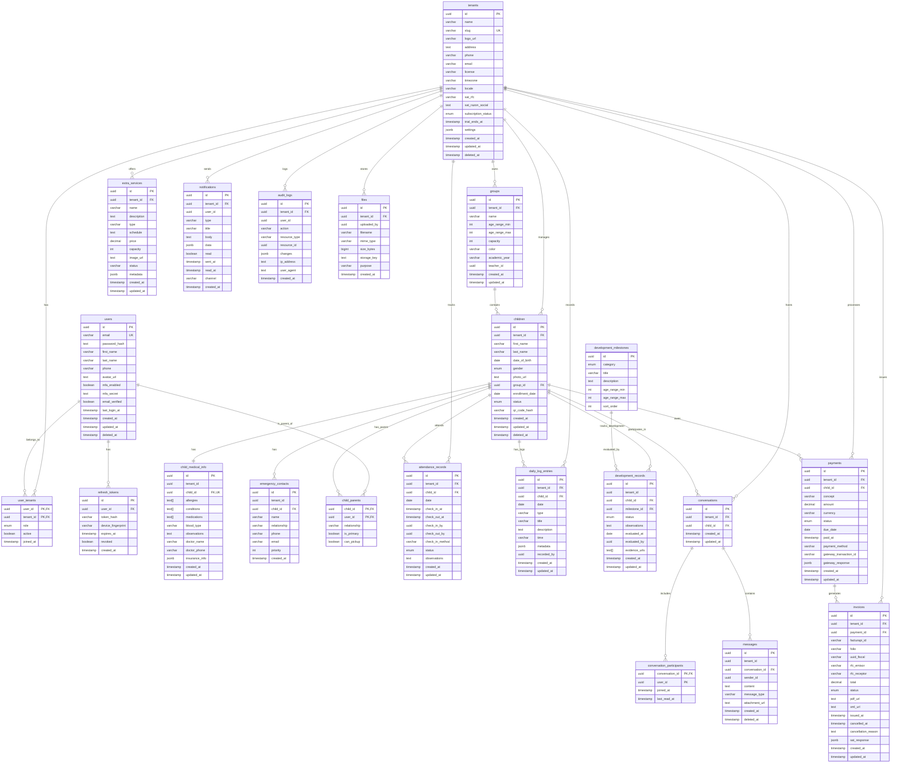

# Little Bees - Database ERD

```mermaid
erDiagram
    tenants {
        uuid id PK
        varchar name
        varchar slug UK
        varchar logo_url
        text address
        varchar phone
        varchar email
        varchar license
        varchar timezone
        varchar locale
        varchar sat_rfc
        text sat_razon_social
        enum subscription_status
        timestamp trial_ends_at
        jsonb settings
        timestamp created_at
        timestamp updated_at
        timestamp deleted_at
    }

    users {
        uuid id PK
        varchar email UK
        text password_hash
        varchar first_name
        varchar last_name
        varchar phone
        text avatar_url
        boolean mfa_enabled
        text mfa_secret
        boolean email_verified
        timestamp last_login_at
        timestamp created_at
        timestamp updated_at
        timestamp deleted_at
    }

    user_tenants {
        uuid user_id PK,FK
        uuid tenant_id PK,FK
        enum role
        boolean active
        timestamp joined_at
    }

    refresh_tokens {
        uuid id PK
        uuid user_id FK
        varchar token_hash
        varchar device_fingerprint
        timestamp expires_at
        boolean revoked
        timestamp created_at
    }

    groups {
        uuid id PK
        uuid tenant_id FK
        varchar name
        int age_range_min
        int age_range_max
        int capacity
        varchar color
        varchar academic_year
        uuid teacher_id
        timestamp created_at
        timestamp updated_at
    }

    children {
        uuid id PK
        uuid tenant_id FK
        varchar first_name
        varchar last_name
        date date_of_birth
        enum gender
        text photo_url
        uuid group_id FK
        date enrollment_date
        enum status
        varchar qr_code_hash
        timestamp created_at
        timestamp updated_at
        timestamp deleted_at
    }

    child_medical_info {
        uuid id PK
        uuid tenant_id
        uuid child_id FK,UK
        text[] allergies
        text[] conditions
        text[] medications
        varchar blood_type
        text observations
        varchar doctor_name
        varchar doctor_phone
        jsonb insurance_info
        timestamp created_at
        timestamp updated_at
    }

    emergency_contacts {
        uuid id PK
        uuid tenant_id
        uuid child_id FK
        varchar name
        varchar relationship
        varchar phone
        varchar email
        int priority
        timestamp created_at
    }

    child_parents {
        uuid child_id PK,FK
        uuid user_id PK,FK
        varchar relationship
        boolean is_primary
        boolean can_pickup
    }

    attendance_records {
        uuid id PK
        uuid tenant_id FK
        uuid child_id FK
        date date
        timestamp check_in_at
        timestamp check_out_at
        uuid check_in_by
        uuid check_out_by
        varchar check_in_method
        enum status
        text observations
        timestamp created_at
        timestamp updated_at
    }

    daily_log_entries {
        uuid id PK
        uuid tenant_id FK
        uuid child_id FK
        date date
        varchar type
        varchar title
        text description
        varchar time
        jsonb metadata
        uuid recorded_by
        timestamp created_at
        timestamp updated_at
    }

    development_milestones {
        uuid id PK
        enum category
        varchar title
        text description
        int age_range_min
        int age_range_max
        int sort_order
    }

    development_records {
        uuid id PK
        uuid tenant_id
        uuid child_id FK
        uuid milestone_id FK
        enum status
        text observations
        date evaluated_at
        uuid evaluated_by
        text[] evidence_urls
        timestamp created_at
        timestamp updated_at
    }

    conversations {
        uuid id PK
        uuid tenant_id FK
        uuid child_id FK
        timestamp created_at
        timestamp updated_at
    }

    conversation_participants {
        uuid conversation_id PK,FK
        uuid user_id PK
        timestamp joined_at
        timestamp last_read_at
    }

    messages {
        uuid id PK
        uuid tenant_id
        uuid conversation_id FK
        uuid sender_id
        text content
        varchar message_type
        text attachment_url
        timestamp created_at
        timestamp deleted_at
    }

    payments {
        uuid id PK
        uuid tenant_id FK
        uuid child_id FK
        varchar concept
        decimal amount
        varchar currency
        enum status
        date due_date
        timestamp paid_at
        varchar payment_method
        varchar gateway_transaction_id
        jsonb gateway_response
        timestamp created_at
        timestamp updated_at
    }

    invoices {
        uuid id PK
        uuid tenant_id FK
        uuid payment_id FK
        varchar facturapi_id
        varchar folio
        varchar uuid_fiscal
        varchar rfc_emisor
        varchar rfc_receptor
        decimal total
        enum status
        text pdf_url
        text xml_url
        timestamp issued_at
        timestamp cancelled_at
        text cancellation_reason
        jsonb sat_response
        timestamp created_at
        timestamp updated_at
    }

    extra_services {
        uuid id PK
        uuid tenant_id FK
        varchar name
        text description
        varchar type
        text schedule
        decimal price
        int capacity
        text image_url
        varchar status
        jsonb metadata
        timestamp created_at
        timestamp updated_at
    }

    notifications {
        uuid id PK
        uuid tenant_id FK
        uuid user_id
        varchar type
        varchar title
        text body
        jsonb data
        boolean read
        timestamp sent_at
        timestamp read_at
        varchar channel
        timestamp created_at
    }

    audit_logs {
        uuid id PK
        uuid tenant_id FK
        uuid user_id
        varchar action
        varchar resource_type
        uuid resource_id
        jsonb changes
        text ip_address
        text user_agent
        timestamp created_at
    }

    files {
        uuid id PK
        uuid tenant_id FK
        uuid uploaded_by
        varchar filename
        varchar mime_type
        bigint size_bytes
        text storage_key
        varchar purpose
        timestamp created_at
    }

    %% Tenant relationships
    tenants ||--o{ user_tenants : "has"
    tenants ||--o{ groups : "owns"
    tenants ||--o{ children : "manages"
    tenants ||--o{ attendance_records : "tracks"
    tenants ||--o{ daily_log_entries : "records"
    tenants ||--o{ conversations : "hosts"
    tenants ||--o{ payments : "processes"
    tenants ||--o{ invoices : "issues"
    tenants ||--o{ notifications : "sends"
    tenants ||--o{ audit_logs : "logs"
    tenants ||--o{ files : "stores"
    tenants ||--o{ extra_services : "offers"

    %% User relationships
    users ||--o{ user_tenants : "belongs_to"
    users ||--o{ refresh_tokens : "has"
    users ||--o{ child_parents : "is_parent_of"

    %% Group and Children relationships
    groups ||--o{ children : "contains"
    children ||--|| child_medical_info : "has"
    children ||--o{ emergency_contacts : "has"
    children ||--o{ child_parents : "has_parent"
    children ||--o{ attendance_records : "attends"
    children ||--o{ daily_log_entries : "has_logs"
    children ||--o{ development_records : "tracks_development"
    children ||--o{ payments : "owes"
    children ||--o{ conversations : "participates_in"

    %% Development tracking
    development_milestones ||--o{ development_records : "evaluated_by"

    %% Conversations and Messages
    conversations ||--o{ conversation_participants : "includes"
    conversations ||--o{ messages : "contains"

    %% Payments and Invoices
    payments ||--o{ invoices : "generates"
```
